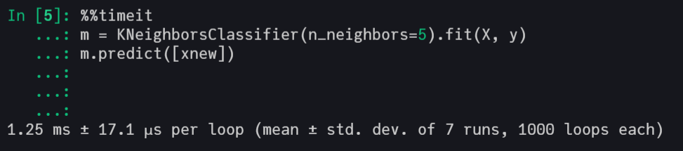
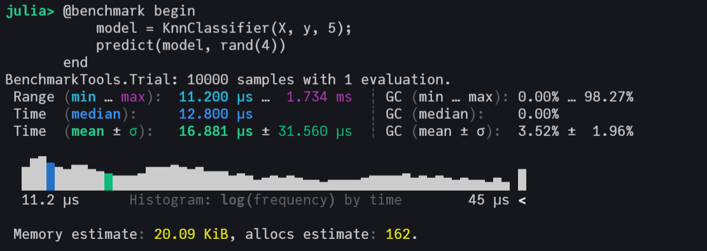

## K-Nearest-Neighbours (KNN) from Scratch with Julia

This repo implements the KNN **classification** and **regression** model in pure Julia code. The objective is to demonstrate the practical implementation of the model to aid the learning process of anyone. 

We suggest using the [NearestNeighbors.jl](https://github.com/KristofferC/NearestNeighbors.jl/) package for serious use of this model in real applications with Julia.

Inspired by Scikit-Learn implementation of KNN, you just need to pass the data as Matrix in X argument, the variable to predict like Vector in y argument and the number of K to fit the model. Also, to make a prediction use the `predict()` function adding the new data in arguments.

```julia
# package to import data
using RDatasets, DataFrames

# prepare data to model
df = dataset("datasets", "iris");
X = Array(df[:, 1:end-1]);
y = Array(df[:, end]);

# load the knn model
include("knn_functions.jl")

# fit the model
K = 5
model = KnnClassifier(X, y, K);

# predict new data
predict(model, rand(4))         # 1 observation
predict(model, rand(10, 4))     # multiple observations
```

This implementation is **faster than the Scikit-Learn** model, showed in the pictures below, mainly because of two reasons:  
* It's has been created with Julia with all the good practices to extract the maximum performance possible of the lang.  
* That it's an light implementation, just with the minimum requirements to use a KNN model, with train and prediction.  

**Scikit-Learn with C in backend**
  

**This Julia implementation**
  